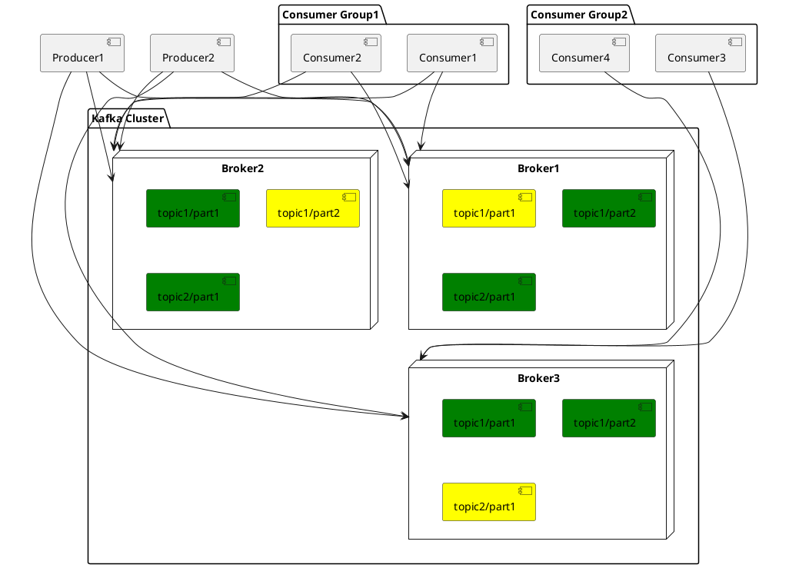
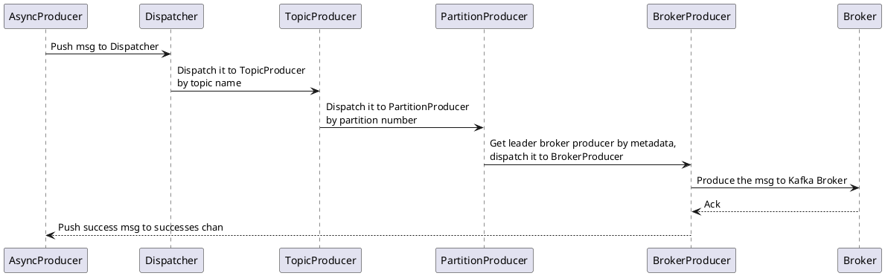
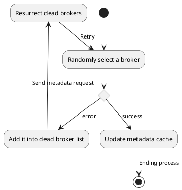
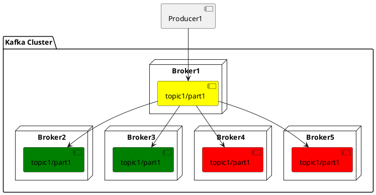
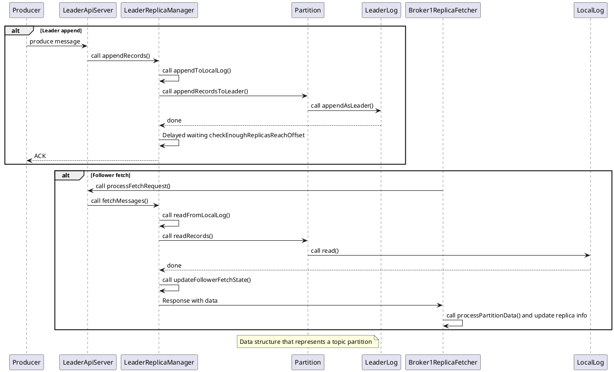

# Kafka: a Distributed Messaging System

[hi-rustin](https://github.com/hi-rustin)

<div class="pt-12">
  <span @click="$slidev.nav.next" class="px-2 py-1 rounded cursor-pointer" hover="bg-white bg-opacity-10">
    Press Space for next page <carbon:arrow-right class="inline"/>
  </span>
</div>

---
layout: center
---

# Kafka is a Distributed Messaging System
#### Requirements
#### Architecture
#### Log Format
#### Producer
#### Replication

<br/>

# TiCDC Writes To Kafka
#### max.message.bytes
#### min.insync.replicas
#### auto.create.topics.enable
#### [Issue 4241](https://github.com/pingcap/tiflow/issues/4241)

--- 

# Messaging System Requirements

<div class="req">

<div>

## Log Collection
### User activity events
### Operational metrics
<br/>  

## Message Queue
### 11.11
<br/>  


## Streaming processing
### Kafka streams
</div>

<div class="kafka">


</div>

</div>

<style>
.req {
  display: flex;
  justify-content: space-around;
}
.kafka {
  width: 300px;
  height: 500px;
}
</style>

---

<div class="arch">
<div>

# Architecture

</div>

<div
  class="relation"
>



</div>
</div>

<style>
.arch {
  display: flex;
}

.arch img {
  margin-top: -80px;
}

.relation {
  position: absolute;
  z-index: 1;
  left: 120px;
  top: 60px;
  font-size: 12px;
}

h1 {
  background-color: #2B90B6;
  background-image: linear-gradient(45deg, #4EC5D4 10%, #146b8c 20%);
  background-size: 50%;
  -webkit-background-clip: text;
  -moz-background-clip: text;
  -webkit-text-fill-color: transparent;
  -moz-text-fill-color: transparent;
  writing-mode: vertical-rl;
  text-orientation: mixed;
}
</style>

---

# Log format

```shell
# Topic ticdc-test-0
.
├── 00000000000000000000.index # Data offset index
├── 00000000000000000000.log # Data log
├── 00000000000000000000.timeindex # Data timestamp index
├── 00000000000000000001.index
├── 00000000000000000001.log
├── 00000000000000000001.snapshot
├── 00000000000000000001.timeindex
├── 00000000000000000002.index
├── 00000000000000000002.log
├── 00000000000000000002.snapshot
├── 00000000000000000002.timeindex
├── 00000000000000000003.index
├── 00000000000000000003.log
├── 00000000000000000003.snapshot
└── 00000000000000000003.timeindex
```

---

# Data Log
##### Command
```c
kafka-run-class.sh kafka.tools.DumpLogSegments --deep-iteration --print-data-log --files /kafka/kafka-logs-a3a9cc22d5ef/ticdc-test-0/00000000000000000000.log
```
##### Data
```shell
Dumping /kafka/kafka-logs-a3a9cc22d5ef/ticdc-test-0/00000000000000000000.log
Starting offset: 0
baseOffset: 0 lastOffset: 0 count: 1 baseSequence: 0 lastSequence: 0 producerId: -1 producerEpoch: -1 partitionLeaderEpoch: 0 isTransactional: false isControl: false position: 0 CreateTime: 1652109690071 size: 473 magic: 2 compresscodec: NONE crc: 1685351341 isvalid: true
| offset: 0 isValid: true crc: null keySize: -1 valueSize: 403 CreateTime: 1652109690071 baseOffset: 0 lastOffset: 0 baseSequence: 0 lastSequence: 0 producerEpoch: -1 partitionLeaderEpoch: 0 batchSize: 473 magic: 2 compressType: NONE position: 0 sequence: 0 headerKeys: [] payload: {"id":0,"database":"test","table":"sbtest5","pkNames":null,"isDdl":true,"type":"CREATE","es":1652109688508,"ts":1652109690071,"sql":"CREATE TABLE `sbtest5` (`id` INT NOT NULL AUTO_INCREMENT,`k` INT DEFAULT _UTF8MB4'0' NOT NULL,`c` CHAR(120) DEFAULT _UTF8MB4'' NOT NULL,`pad` CHAR(60) DEFAULT _UTF8MB4'' NOT NULL,PRIMARY KEY(`id`)) ENGINE = innodb","sqlType":null,"mysqlType":null,"data":null,"old":null}
...
```
| baseOffset | lastOffset | count | position | CreatedTime   | size | Messages |
| ---------- | ---------- | ----- | -------- | ------------- | ---- | -------- |
| 0          | 0          | 1     | 0        | 1652109690071 | 473  | Message1 |

###### Message1
| offset | CreatedTime   | payload    |
| ------ | ------------- | ---------- |
| 0      | 1652109690071 | Canal-Json |

---

# Data Offset Index

##### Command
```c
kafka-run-class.sh kafka.tools.DumpLogSegments --deep-iteration --print-data-log --files /kafka/kafka-logs-a3a9cc22d5ef/ticdc-test-0/00000000000000000000.index
```

##### Index
```shell
Dumping /kafka/kafka-logs-26d87e0ee78c/ticdc-test-0/00000000000000000000.index
offset: 1 position: 473
offset: 2 position: 946
```

| offset | position |
| ------ | -------- |
| 1      | 473      |
| 2      | 946      |

---

# Data Timestamp Index
##### Command
```c
kafka-run-class.sh kafka.tools.DumpLogSegments --deep-iteration --print-data-log --files /kafka/kafka-logs-a3a9cc22d5ef/ticdc-test-0/00000000000000000000.timeindex
```
##### Index
```shell
Dumping /kafka/kafka-logs-26d87e0ee78c/ticdc-test-0/00000000000000000000.timeindex
timestamp: 1652110714527 offset: 1
timestamp: 1652110717557 offset: 2
```
| timestamp     | offset |
| ------------- | ------ |
| 1652110714527 | 1      |
| 1652110717557 | 2      |


- Messages with **1652110714527** <= created time < **1652110717557**, have 1 ( = 0 + 1) <= offset < 2 ( = 0 + 2)
- Messages with created time >= **1652110717557**, have their offset >= 2 ( = 0 + 2)

---

# Producer(sarama)

<br/>
<br/>
<br/>



---

# How do producers discover and connect to Broker? (sarama)

<div class="chart">

<div>


</div>

</div>

<style>
.chart {
  display: flex;
  justify-content: center;
}
</style>

---

# How do producers choose partitions? (sarama)

## Official

- default
- round-robin

<br/>
<br/>
<br/>

## TiCDC
- default (table + index)
- index
- table
- ts

---

# Replication

<div class="replication">
<div class="chart">


</div>

<div v-click >

- AR: Assigned Replicas
- ISR: In Sync Replicas
- OSR: Out-of-Sync Replied

* request.required.acks + min.insync.replicas = durability

</div>
</div>

<style>
.replication {
  display: flex;
  justify-content:space-between;
  align-items: center;
}

.chart {
  width: 600px;
}
</style>

---

# [Replication](https://github.com/apache/kafka/blob/000ba031c3d1135cb0e1fe6438d1e464ff10b6b0/core/src/main/scala/kafka/server/KafkaApis.scala#L656)



---

# max.message.bytes

- [Issue 3081](https://github.com/pingcap/tiflow/issues/3081)
- [Issue 3337](https://github.com/pingcap/tiflow/issues/3337)
<br/>
<br/>
- [Batch Size Limits in TiCDC](https://github.com/pingcap/tiflow/blob/544aadb0fb61e7cae6a1e052c78ed37bb3fb2694/cdc/sink/codec/json.go#L454)
- Producer's [MaxMessageBytes](https://github.com/Shopify/sarama/blob/0fe5d534ef6247cf4492a6f2233ef248891a2204/config.go#L166)
- Broker's [message.max.bytes](https://kafka.apache.org/documentation/#brokerconfigs_message.max.bytes)
- Topic's [max.message.bytes](https://kafka.apache.org/documentation/#topicconfigs_max.message.bytes)

---

# min.insync.replicas

- [Issue 3994](https://github.com/pingcap/tiflow/issues/3994)
<br/>
<br/>
- TiCDC Replication factor for creating topics
- Producer's [RequiredAcks](https://github.com/Shopify/sarama/blob/0fe5d534ef6247cf4492a6f2233ef248891a2204/config.go#L170)
  - NoResponse RequiredAcks = 0
  - WaitForLocal RequiredAcks = 1
  - WaitForAll RequiredAcks = -1
- Broker's [min.insync.replicas](https://kafka.apache.org/documentation/#topicconfigs_min.insync.replicas)

---

# auto.create.topics.enable
- There are some jobs and mistakes we can circumvent from the product design
<br/>
<br/>
- Broker's [auto.create.topics.enable](https://kafka.apache.org/documentation/#brokerconfigs_auto.create.topics.enable)
- [The strategy used by cockroach](https://www.cockroachlabs.com/docs/v20.1/change-data-capture.html#create-a-changefeed-connected-to-kafka)

---

# [Issue 4241](https://github.com/pingcap/tiflow/issues/4241)

<br/>
<br/>

> sarama, which is by far the most popular but is quite difficult to work with. It is poorly documented, the API exposes low level concepts of the Kafka protocol, and it doesn't support recent Go features like contexts. It also passes all values as pointers which causes large numbers of dynamic memory allocations, more frequent garbage collections, and higher memory usage.
> 
> 
>                                                                                  -- segmentio/kafka-go

<br/>
<br/>
<br/>
We can't stop the message from retrying!

<br/>
<br/>

[A workaround](https://github.com/pingcap/tiflow/pull/5186)


---

# Missing
<br/>
<br/>
<br/>
<br/>
<br/>

<div class="missing">
<div>

### Kafka Controller
<br/>
<br/>
</div>

<div>

### Kafka Consumer

</div>
</div>

<style>
.missing {
  display: flex;
  flex-direction: column;
  align-items: center;
}
</style>
---

# Refs

<br/>
<br/>

- [Kafka: a Distributed Messaging System for Log Processing](https://www.microsoft.com/en-us/research/wp-content/uploads/2017/09/Kafka.pdf)
- [Kafka: The Definitive Guide](https://www.confluent.io/resources/kafka-the-definitive-guide/)
- [Kafka Source Code](https://github.com/apache/kafka)
- [Sarama Source Code](https://github.com/Shopify/sarama)
- [Cockroach Source Code](https://github.com/cockroachdb/cockroach)
- [rohithsankepally Blog](https://rohithsankepally.github.io/Kafka-Storage-Internals/)
- [Is Kafka a Database?](https://www.youtube.com/watch?v=BuE6JvQE_CY)

---
layout: center
---

# Thanks!