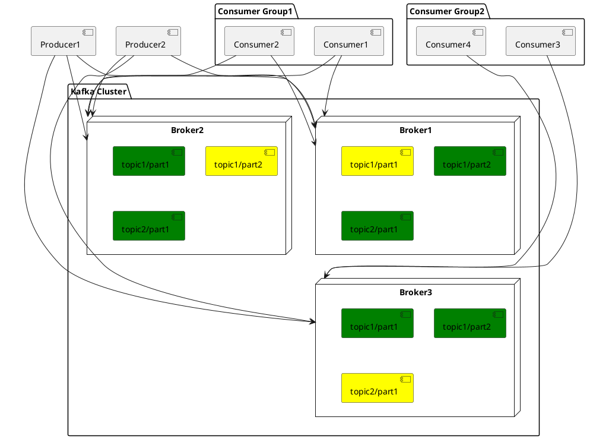

# Kafka: a Distributed Messaging System

[hi-rustin](https://github.com/hi-rustin)

<div class="pt-12">
  <span @click="$slidev.nav.next" class="px-2 py-1 rounded cursor-pointer" hover="bg-white bg-opacity-10">
    Press Space for next page <carbon:arrow-right class="inline"/>
  </span>
</div>

---
layout: center
---

# Kafka is a Distributed Messaging System
#### Requirements
#### Architecture And Design

<br/>

# TiCDC Writes To Kafka
#### max.message.bytes
#### min.insync.replicas

--- 

# Messaging System Requirements
<br/>  
<br/>  


## Log Collection
### User activity events
### Operational metrics
<br/>  

## Message Queue
### 11.11
<br/>  


## Streaming processing
### Kafka streams

---

<div class="arch">
<div>

# Architecture

</div>

<div
  class="relation"
>



</div>
</div>

<style>
.arch {
  display: flex;
}

.arch img {
  margin-top: -80px;
}

.relation {
  position: absolute;
  z-index: 1;
  left: 120px;
  top: 60px;
  font-size: 12px;
}

h1 {
  background-color: #2B90B6;
  background-image: linear-gradient(45deg, #4EC5D4 10%, #146b8c 20%);
  background-size: 50%;
  -webkit-background-clip: text;
  -moz-background-clip: text;
  -webkit-text-fill-color: transparent;
  -moz-text-fill-color: transparent;
  writing-mode: vertical-rl;
  text-orientation: mixed;
}
</style>

---

# Design
## Kafka Log

```shell
# Topic ticdc-test-0
.
├── 00000000000000000000.index # Data offset index
├── 00000000000000000000.log # Data log
├── 00000000000000000000.timeindex # Data timestamp index
├── 00000000000000000001.index
├── 00000000000000000001.log
├── 00000000000000000001.snapshot
├── 00000000000000000001.timeindex
├── 00000000000000000002.index
├── 00000000000000000002.log
├── 00000000000000000002.snapshot
├── 00000000000000000002.timeindex
├── 00000000000000000003.index
├── 00000000000000000003.log
├── 00000000000000000003.snapshot
└── 00000000000000000003.timeindex
```

---

# Data Log
##### Command
```c
kafka-run-class.sh kafka.tools.DumpLogSegments --deep-iteration --print-data-log --files /kafka/kafka-logs-a3a9cc22d5ef/ticdc-test-0/00000000000000000000.log
```
##### Data
```shell
Dumping /kafka/kafka-logs-a3a9cc22d5ef/ticdc-test-0/00000000000000000000.log
Starting offset: 0
baseOffset: 0 lastOffset: 0 count: 1 baseSequence: 0 lastSequence: 0 producerId: -1 producerEpoch: -1 partitionLeaderEpoch: 0 isTransactional: false isControl: false position: 0 CreateTime: 1652109690071 size: 473 magic: 2 compresscodec: NONE crc: 1685351341 isvalid: true
| offset: 0 isValid: true crc: null keySize: -1 valueSize: 403 CreateTime: 1652109690071 baseOffset: 0 lastOffset: 0 baseSequence: 0 lastSequence: 0 producerEpoch: -1 partitionLeaderEpoch: 0 batchSize: 473 magic: 2 compressType: NONE position: 0 sequence: 0 headerKeys: [] payload: {"id":0,"database":"test","table":"sbtest5","pkNames":null,"isDdl":true,"type":"CREATE","es":1652109688508,"ts":1652109690071,"sql":"CREATE TABLE `sbtest5` (`id` INT NOT NULL AUTO_INCREMENT,`k` INT DEFAULT _UTF8MB4'0' NOT NULL,`c` CHAR(120) DEFAULT _UTF8MB4'' NOT NULL,`pad` CHAR(60) DEFAULT _UTF8MB4'' NOT NULL,PRIMARY KEY(`id`)) ENGINE = innodb","sqlType":null,"mysqlType":null,"data":null,"old":null}
...
```
##### Parse
| baseOffset | lastOffset | count | position | CreatedTime   | size | Messages |
| ---------- | ---------- | ----- | -------- | ------------- | ---- | -------- |
| 0          | 0          | 1     | 0        | 1652109690071 | 473  | Message1 |

###### Message1
| offset | CreatedTime   | payload    |
| ------ | ------------- | ---------- |
| 0      | 1652109690071 | Canal-Json |

---

# Data Offset Index

##### Command
```c
kafka-run-class.sh kafka.tools.DumpLogSegments --deep-iteration --print-data-log --files /kafka/kafka-logs-a3a9cc22d5ef/ticdc-test-0/00000000000000000000.index
```