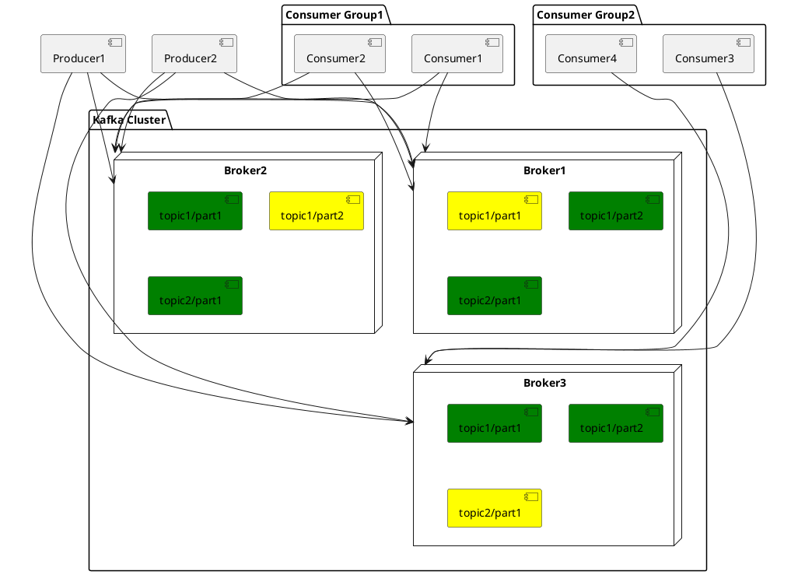

# Kafka: a Distributed Messaging System and an ACID Database

[hi-rustin](https://github.com/hi-rustin)

  
    Press Space for next page <carbon:arrow-right class="inline"/>
  

---
layout: center
---

# Kafka is a Distributed Messaging System
#### Requirements
#### Architecture And Design

 

# Kafka is an ACID Database
#### Atomicity
#### Consistency
#### Isolation
#### Durability

 

# TiCDC Writes To Kafka

--- 

# Messaging System Requirements
   
   

## Log Collection
### User activity events
### Operational metrics
   

## Message Queue
### 11.11
   

## Streaming processing
### Kafka streams

---

# Architecture

